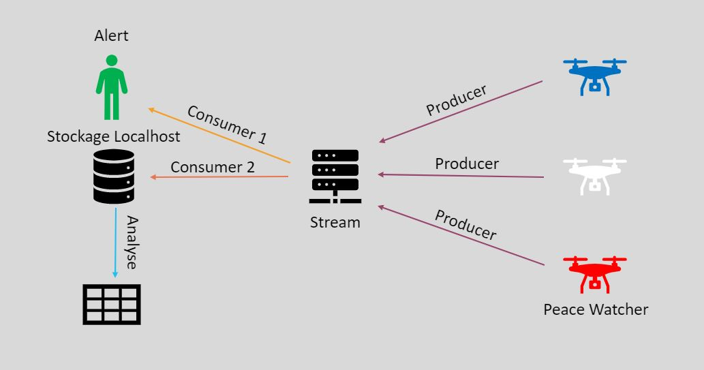

# ScalaStream
- Scala Stream is a project that allows to see in action a producer and a consumer who respectively send and receive data using a stream that allows them to communicate. 
- This project was given to me during my engineering school curriculum. 
- The Producer simulates a drone that sends information from people who have allegedly committed an infringement 
- while the Consumer simulates the data receiver who processes and uses this same data.

#Info

- This project has been tested in Ubuntu Virtual Machine.

# Requirement
- scalaVersion --> "2.12.10"
- spark-core --> "2.12.10"
- spark-sql --> "2.12.10"
- spark-avro --> "2.12.10"
- spark-streaming --> "2.12.10"
- spark-streaming-kafka-0-10 --> "2.12.10"
- spark-sql-kafka-0-10 --> "2.12.10"
- sparkVersion --> "3.0.0"
- kafka-clients --> "2.2.1"
- typesafe config --> "1.3.3"
- play-json --> "2.9.0"

# How it works
- This project Works with few terminals:
- One for Stream 
- One for zookeeper
- One for Producer : Will send random generated data every 30000 milliseconds 
- One for Consumer : Will check every 1000 milliseconds if there are data generated from Producer 
- One for Analyse the Output : Will Warn in the terminal if there are dangerous people
- One for Store the Output

# Architecture

